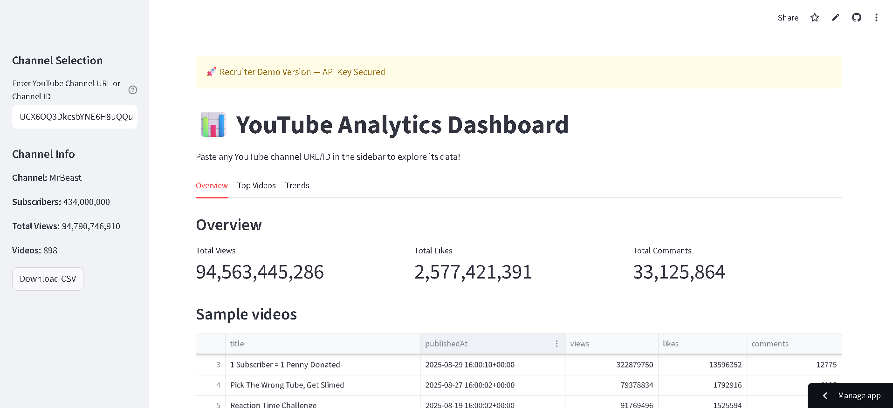
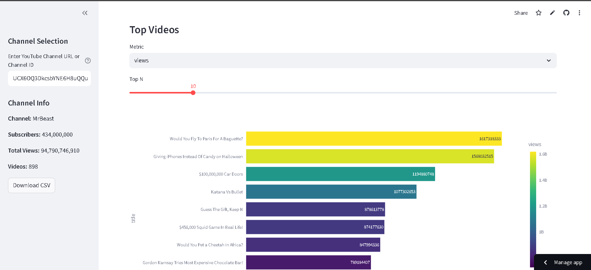
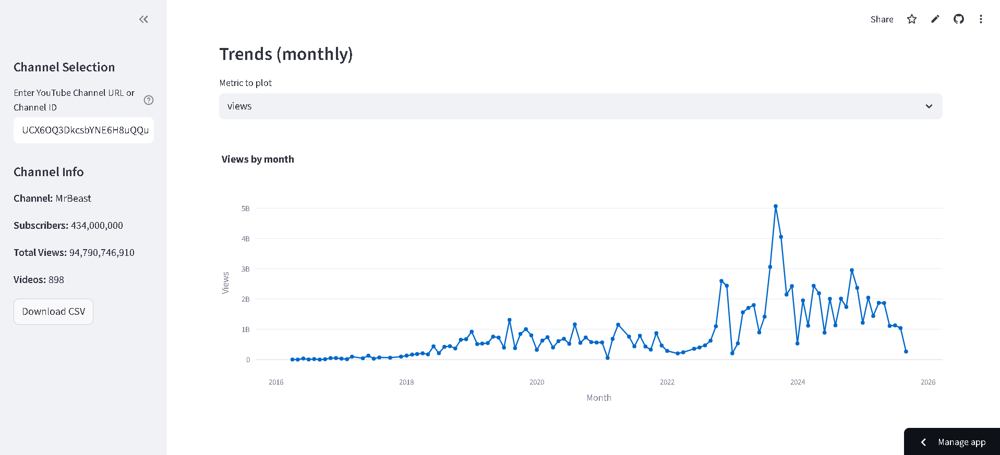

# 📊 YouTube Analytics Dashboard  

An interactive dashboard built with **Streamlit** that provides insights into any YouTube channel using the **YouTube Data API v3**.  

## 🚀 Features  
- Fetch real-time channel statistics (subscribers, total views, total videos)  
- Explore video performance (views, likes, comments)  
- View top videos by selected metric  
- Analyze monthly trends with interactive charts  
- Export filtered data to CSV  

## 🛠️ Tech Stack  
- **Python**  
- **Streamlit** (for dashboard)  
- **Plotly Express** (for visualizations)  
- **Pandas** (for data handling)  
- **YouTube Data API v3**  

## 📸 Screenshots

### Dashboard


### Top Videos


### Trends



---

## ⚙️ Setup Instructions  

1. **Clone this repository**  
   ```bash
   git clone https://github.com/YOUR_USERNAME/YOTUBE_DATA_ANALYTICS.git
   cd YOTUBE_DATA_ANALYTICS
   ```

2. **Install dependencies**  
   ```bash
   pip install -r requirements.txt
   ```

3. **Set up your API key**  
   - Enable **YouTube Data API v3** in [Google Cloud Console](https://console.cloud.google.com/apis/library).  
   - Create an API key under **APIs & Services → Credentials**.  
   - Save your key in one of these ways:  
     - Locally in `config.py`:  
       ```python
       API_KEY = "your_api_key_here"
       ```  
     - Or securely in **Streamlit secrets** if deploying on Streamlit Cloud.  

4. **Run the app**  
   ```bash
   streamlit run youtube_analytics_streamlit.py
   ```

---

## 🌍 Live Demo   
👉 [Click here to try the app](https://yotubedataanalytics-5at2shvkhzsujbvdphkny5.streamlit.app/ )  
 
---

## 📂 Project Structure  
```
YOTUBE_DATA_ANALYTICS/
│
├── youtube_analytics_streamlit.py   # main Streamlit app
├── requirements.txt                 # Python dependencies
├── README.md                        # Project description + screenshots + links
│
├── screenshots/                     # all images for README
│   ├── dashboard.png
│   ├── top_videos.png
│   └── trends.png
│
└── .streamlit/                      # Streamlit config folder (not uploaded to GitHub usually)
    └── secrets.toml                  # API_KEY, CHANNEL_ID (private)

```

---

## 💡 Future Improvements  
- Add sentiment analysis of comments  
- Compare multiple channels  
- Schedule automatic updates  

---

## 🤝 Connect with Me  
-[LinkedIn Profile](https://www.linkedin.com/in/prithvi-jain-122422329)

- [GitHub](https://github.com/PRITHVI30JAIN/YOTUBE_DATA_ANALYTICS)  
